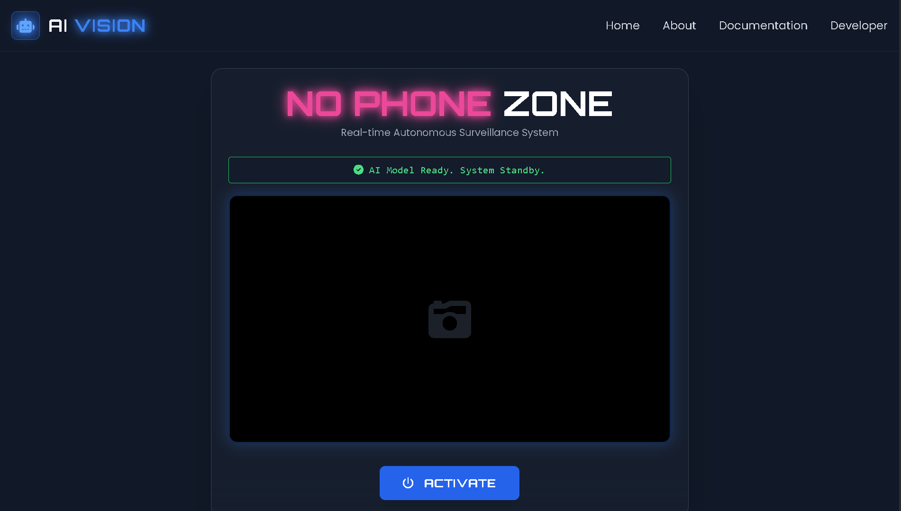
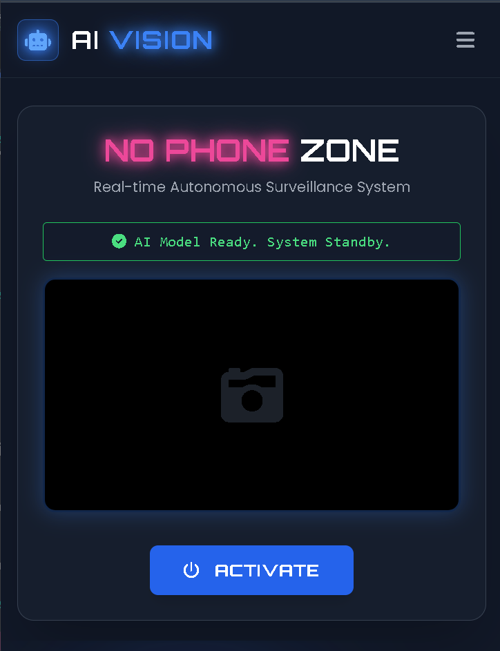

<div align="center">
  
  <a href="https://git.io/typing-svg">
    
  </a>
   <br/>

  
  
  
  
</div>
  


 

  <p align="center">
    <a href="https://atul-dev-ai.github.io/Mobile-Detection-Two/">View Live Demo</a> •
    <a href="#-features">Features</a> •
    <a href="#-how-to-run">How To Run</a> •
    <a href="https://github.com/atul-dev-ai">Author</a>
  </p>

</div>

---

## 👁️ Project Overview

**AI Vision System** is a cutting-edge, browser-based surveillance tool designed to create secure **"No Phone Zones"**. Leveraging the power of **TensorFlow.js** and the **COCO-SSD** model, it detects unauthorized mobile devices in real-time directly from the client's camera feed.

When a phone is detected with high confidence, the system triggers an immediate **Voice Alert** and visual warning, ensuring strict security compliance without sending any video data to external servers (Privacy-First).

---

## ✨ Key Features

### 🤖 Intelligent Detection
- **Real-time Processing:** Uses `coco-ssd` to detect objects at 60 FPS (depending on hardware).
- **High Accuracy:** Filters detections with a confidence threshold of >70%.
- **Bounding Boxes:** Draws futuristic neon bounding boxes around detected objects.

### 🔊 Smart Alert System
- **Audio Warning:** Automatically plays a voice alert (`audio.mp3`) when a "cell phone" is detected.
- **Visual Feedback:** The entire UI shifts to a "Danger Mode" (Red/Pink Glow) upon detection.

### 🎨 Cyberpunk UI/UX
- **Glassmorphism Design:** Modern, translucent UI components built with **Tailwind CSS**.
- **Responsive:** Fully optimized for Desktops, Tablets, and Mobile devices.
- **Neon Aesthetics:** Features glowing text, scanning lines, and `Orbitron` fonts for a sci-fi feel.

---

## 📸 Screenshots

| **Desktop Interface** | **Mobile Interface** |
|:---:|:---:|
|  |  |

> *https://atul-dev-ai.github.io/Mobile-Detection-Two*

---

## 🛠️ Tech Stack

* **Frontend Framework:** HTML5 & Tailwind CSS
* **Logic & DOM Manipulation:** Vanilla JavaScript (ES6+)
* **Machine Learning:** TensorFlow.js (Client-side)
* **Pre-trained Model:** COCO-SSD (Common Objects in Context)
* **Icons:** FontAwesome 6

---

## 🚀 How to Run Locally

Since this project uses modern browser APIs (Camera), it requires a secure context (`HTTPS` or `localhost`).

1.  **Clone the Repository**
    ```bash
    git clone https://github.com/atul-dev-ai/Mobile-Detection-Two.git
    ```

2.  **Navigate to Folder**
    ```bash
    cd Mobile-Detection
    ```

3.  **Launch via Live Server (Recommended)**
    * Open the folder in **VS Code**.
    * Install the **"Live Server"** extension.
    * Right-click `index.html` and select **"Open with Live Server"**.

    *⚠️ **Note:** Simply double-clicking `index.html` might block camera access due to browser security policies.*

---

## 🤝 Contributing

Contributions are welcome! If you want to add features like "Face Detection" or "Log Recording":

1.  Fork the Project.
2.  Create your Feature Branch (`git checkout -b feature/AmazingFeature`).
3.  Commit your Changes (`git commit -m 'Add some AmazingFeature'`).
4.  Push to the Branch (`git push origin feature/AmazingFeature`).
5.  Open a Pull Request.

---

## 👨‍💻 Author

**Atul Paul**

* **GitHub:** [@atul-dev-ai](https://github.com/atul-dev-ai)
* **Portfolio:** [atulpaul.vercel.app](https://atulpaul.vercel.app)
* **Email:** paulatul020@gmail.com

<div align="center">
  <br>
  <p><i>Made with ❤️, TensorFlow, and lots of Coffee ☕</i></p>
  
</div>
